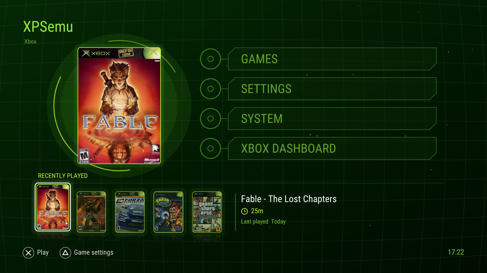

<p align="center">
  
</p>

<p align="center">
  <b>The original Xbox, running natively on a PlayStation 5.</b><br>
  A port of <a href="https://xemu.app">xemu</a> to the PS5 as a native app, with its own Xbox-style dashboard.
</p>

<p align="center">
  
  
  
  
  
</p>

---

<p align="center">
  
</p>

> **Alpha 2** is an early build. It boots and plays real games, but expect bugs, slow scenes in
> CPU-heavy games, and missing features. Please report problems with your `xemu-game.log` attached (see [Logs](#logs-and-reporting-problems)).

## Table of contents

- [What is XPSemu?](#what-is-xpsemu)
- [Features](#features)
- [Compatibility](#compatibility)
- [Requirements](#requirements)
- [Installation](#installation)
- [Folder layout on the PS5](#folder-layout-on-the-ps5)
- [Controls](#controls)
- [Game patches](#game-patches)
- [Performance notes](#performance-notes)
- [Logs and reporting problems](#logs-and-reporting-problems)
- [Known limitations](#known-limitations)
- [What XPSemu changes in xemu](#what-xpsemu-changes-in-xemu)
- [Building from source](#building-from-source)
- [Credits](#credits)
- [License](#license-and-legal)

## What is XPSemu?

XPSemu is [xemu](https://github.com/xemu-project/xemu), the open-source original Xbox emulator, ported
to the PlayStation 5 as a native application. the whole emulator (Xbox CPU through QEMU's TCG JIT, the NV2A GPU through xemu's Vulkan
renderer, the MCPX audio, the controllers) runs as a PS5 app on top of an open-source Vulkan driver
(RADV, from the PS5_Vulkan project).

XPSemu adds its own controller-friendly dashboard, per-game settings, cover art,
play time, game patches, a performance overlay, a per-game log and a set of CPU optimizations made for
the PS5's Zen 2 processor.

## Features

**Setup**
- Only your MCPX boot ROM and BIOS are needed: a blank Xbox hard disk is created for you if you have none.
- A setup screen shows which files are missing and updates by itself as you copy them over.
- Games from `/data/xemu/games/` or from `xemu/games/` on any USB or external drive.

**Dashboard**
- Xbox-style dashboard made for the DualSense: animated green background, main menu, recently played shelf.
- **Games** page: a 3D row of game cases with box art, reflections, smooth scrolling and a launch animation.
- **Box Art Viewer**: the full game case in 3D (front, back and spine) to turn, zoom and flip.
- Game names from the ISO file name (rename any game from its settings); covers downloaded automatically, or your own in a folder (`.jpg` / `.png`).
- **Recently played** shelf and **play time** per game.
- **Original Xbox Dashboard**: boots the dashboard on your HDD image: the original Microsoft one, You will need to have it installed on the HDD.
- Menu sounds and dashboard music (can be turned off), title shine animation, app icon and background art.
- XPSemu startup logo and sound; the original Xbox startup animation can be turned on in Settings.
- Settings in categories: Video, Sound, Interface, Controller, Patches, Advanced.

**Per-game**
- Own settings per game: screen shape, fit, volume, performance overlay.
- **Game patches** in Jay's Magic Patch (`.jmp`) format, applied in memory while the game loads: your ISO files are never modified.
- Automatic checksum matching: patches that are not made for your copy are blocked and labelled.
- **Patch Store**: get patches for each game from Jay's Magic Patches, checked against your copy first; all active patches in Settings > Patches.
- **Home-screen shortcuts**: any game as its own PS5 title, with its cover and 4K background art, opening straight into the game.
- Crash watcher: if a game crashes back to the Xbox dashboard, XPSemu tells you and notes it in the log.

**System**
- Xbox video modes (widescreen, 720p) set per game automatically, in the emulated Xbox's EEPROM.
- DualSense button remapping with a live tester.
- Blades side art beside 4:3 games (optional).
- Resolution scaling 1x (480p) to 4x, with the resolution shown next to each option.
- Performance overlay (FPS, frame time, CPU, memory).
- Per-game log (`xemu-game.log`) with FPS, frame times and what the emulator spends its time on.
- Shader, pipeline and driver caches on disk, so a second run of a game stutters much less.

## Compatibility

Tested on a PS5 Fat with Alpha 2. many Xbox games are capped at 30 or 60.

| Game | Status | Notes |
|---|---|---|
| Halo 2 | ✅ Playable | 30 FPS stock. With the Halo 2 60 FPS patch: 51-60 FPS in the opening, 36-50 in gameplay.. |
| Forza Motorsport | ⚠️ In-game | 30 FPS (its cap) in menus and intro, 18-25 FPS while racing. |
| Fable: The Lost Chapters | ⚠️ In-game | 22-30 FPS in many areas (30 is its cap), 10-20 FPS in heavy areas. |
| Crash Bandicoot: The Wrath of Cortex | ✅ Playable | 60 FPS. |
| Halo: Combat Evolved | ✅ Playable | 30 FPS (its cap). 60 FPS with a FPS patch. |
| Ninja Gaiden Black | ✅ Playable | 60 FPS. |
| Jet Set Radio Future | ✅ Playable | 50-60 FPS. |
| Crash Nitro Kart | ✅ Good | 30 FPS most of the time. |

Anything that runs well in xemu on PC has a good chance of running here.
see xemu's own
[compatibility list](https://xemu.app/#compatibility)

## Requirements

- A **jailbroken PS5.**
- **`helper.elf`**: included in the release.
- **[ShadowMountPlus](https://github.com/drakmor/ShadowMountPlus)**.
- **Your own** original Xbox files, dumped from your own console (not included, never will be):
  - MCPX boot ROM: `mcpx_1.0.bin`
  - Xbox BIOS / flash ROM: `Complex_4627.bin`
  - Optional: your own Xbox hard-disk image `xbox_hdd.qcow2`. Without one, XPSemu creates a blank one for you.
- **Your own games** as **XISO** images (`.iso` / `.xiso`). Full "redump" disc images must be converted to XISO first (for example with [extract-xiso](https://github.com/XboxDev/extract-xiso)).

## Installation

1. Download PPSA97358.zip, extract it, and copy PPSA97358/ to /data/homebrew/.
2. Load helper.elf with kstuff.
Put mcpx_1.0.bin and your BIOS Complex_4627.bin in/data/xemu/.
3. Put your games in /data/xemu/games/ or in xemu/games/ on a USB drive.
4. Launch XPSemu from the home screen

If the app closes right away or says "helper.elf didn't answer", check that kstuff + `helper.elf` are loaded, then start XPSemu again. If a file is missing, XPSemu shows a setup screen listing what's needed.

## Folder layout on the PS5

Everything XPSemu writes lives under `/data/xemu/` (an app's own folder is read-only on the PS5).

| Path | What it is |
|---|---|
| `/data/xemu/xemu.toml` | Main settings (xemu's format; the dashboard edits it for you). |
| `/data/xemu/games/` | Your XISO games. |
| `/data/xemu/games/covers/` or `/data/xemu/covers/` | Cover art: `<game name>.jpg` same as the iso name or the title ID (e.g. `4D530064.jpg`) works too, png also supported. |
| `/data/xemu/patches/` | `.jmp` game patches (subfolders are fine). |
| `/data/xemu/sounds/` | Optional: your own menu sounds (`move`, `change`, `select`, `back`, `open`, `launch`, `error` `.wav`) replace the built-in ones. |
| `/data/xemu/game-settings/` | Per-game settings and patch choices (written by the dashboard). |
| `/data/xemu/playtime.txt`, `recent.txt` | Play time and the recently played list. |
| `/data/xemu/cache/` | Shader (SPIR-V), Vulkan pipeline and driver caches. Safe to delete; they rebuild. |
| `/data/xemu/xemu.log` | The emulator's log (previous run: `xemu.log.old`). |
| `/data/xemu/xemu-game.log` | Per-game log of the last game you played (previous: `.old`). |

## Controls

**In games** (DualSense → Xbox controller)

| DualSense | Xbox |
|---|---|
| ✕ / ○ / □ / △ | A / B / X / Y |
| L1 / R1 | White / Black |
| L2 / R2 | Left / Right trigger (analog) |
| Left / right stick, L3 / R3 | Left / right stick, stick clicks |
| D-pad | D-pad |
| OPTIONS | Start |
| Create | Back |
| **Touchpad click** | Open the XPSemu dashboard (the PS button belongs to the system) |

**In the dashboard**

| Button | Action |
|---|---|
| D-pad / left stick | Move |
| ✕ | Select / launch / change a value |
| ○ | Back |
| △ (on a game) | That game's settings and patches |
| L1 / R1 (Games page) | Jump 5 games |
| Touchpad | Return to the running game |

## Game patches

XPSemu reads patches in **Jay's Magic Patch** format (`.jmp`, as published on [JayXbox PatchHub](https://www.jayxbox.com/Retail-Game-Modification/PatchHub.php)) from
`/data/xemu/patches/`. Open a game's settings (△) → **Game patches** to turn patches on or off.

- Patches are applied **in memory while the game reads its executable**. Your ISO is never changed.
- XPSemu computes your copy's checksum and compares it with the patch:
  - **Works**: made for your copy, or made for another release but every searched code pattern was found exactly once in yours.
  - **Other version** / **Not in this game** / **Not supported**: blocked, with the reason shown.
- Patches that **append** new code to the executable (`APPEND` records, such as Halo 2 HD) are not supported.
- A notification confirms when a patch was really applied while the game loaded.

## Performance notes

On the PS5 the **emulated Xbox CPU is the bottleneck**: the Xbox CPU thread is busy 85-97% of the
time while the PS5 GPU is mostly idle. That is why raising the resolution does not lower FPS (use 3x/4x
freely).

Tips:
- **DSP Off**, always.
- Leave **CPU pinning** always on.
- The first time you play a game it compiles shaders; the second run is much smoother (caches in `/data/xemu/cache`).

## Logs and reporting problems

After playing, copy `/data/xemu/xemu-game.log` (and `xemu.log`) from the PS5. The game log has:
- a header with the game, title ID, file, settings, caches and patches,
- every 5 s: FPS, slowest frame, CPU load per emulator thread, GPU work, and time spent per step,

When reporting a problem, include the game name, what happened, and both logs.

## Known limitations

- **Alpha**: expect bugs.
- **CPU-bound**: heavy scenes in some games run below their cap (see above).
- **64 MB Xbox memory only** (no 128 MB debug-kit mode).
- **XISO only**: full redump images must be converted.
- **Patches with APPEND records** are not supported.
- No save states or save manager yet (games save to the HDD image as on a real Xbox).

## What XPSemu changes in xemu

XPSemu is based on xemu `0.8.136` (upstream commit `478b4f4961`). Everything below is in this repository.
PS5-only code is guarded with `#ifdef __PROSPERO__`, so the desktop build of xemu is unchanged by most of it.
A full diff of the modified upstream files is in [`ps5/XPSEMU-CHANGES.diff`](ps5/XPSEMU-CHANGES.diff).

### Making xemu run on the PS5

- **Cross-build for the PS5**: meson cross file (`ps5/ps5-cross.ini`), `ps5/configure-ps5.sh`, and
  `ps5/deps/build-deps.sh`, which cross-compiles xemu's libraries (zlib, libiconv, GLib, pixman,
  libsamplerate, SDL3, libpcap, curl, libslirp) as static libraries with the PS5 toolchain.
- **Vulkan-only build**: OpenGL/epoxy made optional (`meson.build`, pgraph GL renderer and gloffscreen
  guarded), Vulkan enabled on the PS5's FreeBSD-based OS, the DSP56300 Rust JIT made optional with the
  interpreter as fallback.
- **New Vulkan presentation for the UI** (`ui/xui/vk-present.cc`, `ui/xemu-texture.h`,
  `hw/xbox/nv2a/pgraph/vk/vk-ui.h`): xemu's UI normally needs an OpenGL window; on the PS5 it draws with
  Dear ImGui's Vulkan backend onto a 4K `VK_KHR_display` swapchain, sharing the device and queue with
  the NV2A renderer. Screenshots and thumbnails read back through Vulkan.
- **Linking as a PS5 title** (`ps5/build-title.sh`): relinks xemu's objects with RADV, the payload SDK's
  libc++ and platform layer, the CRT and AGC stubs from PS5_Vulkan, then makes the signed `eboot.bin`,
  `param.json` and art for `PPSA97358`.
- **Missing C library pieces** (`ps5/compat/`): user-space `getcontext`/`makecontext`/`swapcontext` for
  QEMU's coroutines, `ppoll`, `pipe2`, `closefrom`, `timegm`, `mkstemp`, `fnmatch` and other gaps,
  and a startup scan that reports any unresolved system import.
- **Memory** (`ps5/compat/mmap.c`, `tcg/region.c`, `util/oslib-posix.c`): `mmap` mapped onto the PS5's
  flexible/direct memory, allocations kept out of the GPU's address window, the TCG JIT buffer in
  executable shared memory, coroutine stacks from the heap, file-mapping fallback to
  read-into-memory.
- **Sandbox**: requests the app from `helper.elf` at startup; all data under `/data/xemu`.
- **DualSense input** (`ui/xemu-input-ps5.c`) through libScePad, mapped to an Xbox controller.
- **Audio** through SceAudioOut (`hw/xbox/mcpx/apu/monitor.c`).
- **Crash handler and logging**: crash address, backtrace and load address in `xemu.log`, kernel
  notifications on fatal errors, hide the PS5 splash screen after the first frame.
- **Startup behaviour**: Xbox starts powered off (`-S`), no auto-resume of the last game, 64 MB forced,
  `geteuid`/`getegid` wrapped so Mesa's shader cache works after helper.elf grants access.

### New features (XPSemu's own code)

| File | What |
|---|---|
| `ui/xui/dashboard.cc/.hh` | The dashboard: pages, carousel, shelf, settings, patches UI, crash watcher. |
| `ui/xui/xiso.cc/.hh` | Reads `default.xbe` from XISO/redump images: title, title ID, checksum. |
| `ui/xui/game-profile.cc/.hh` | Per-game settings and play time. |
| `ui/xui/game-patches.cc/.hh` | `.jmp` parser, checksum matching, in-memory patching (hook in `block/raw-format.c`). |
| `ui/xui/game-log.cc/.hh` | The per-game log and cache saves. |
| `ui/xui/ui-sounds.cc/.hh` | Menu sounds (built-in, embedded, or your own `.wav`). |
| `hw/xbox/xemu-eeprom.h`, `hw/xbox/smbus_storage.c` | Xbox video switches in the EEPROM (with checksum). |
| `hw/xbox/xemu-timing.h` | Stopwatches used by the game log. |
| `ui/xemu-os-utils-ps5.c` | PS5 startup, helper.elf request, blank hard disk, crash handler, pinning. |
| `config_spec.yml` | New settings: performance overlay, menu sounds, CPU pinning, shader cache. |
| `xpsemu-tools/` | Standalone app-request payload (`helper.elf`) |

## Building from source

The build runs on Linux (tested on WSL2 Ubuntu). You need the PS5 toolchain and RADV from
**PS5_Vulkan** (by [Mihawk-99](https://github.com/mihawk-99)) first.

1. **PS5_Vulkan**: clone it to `~/ps5/PS5_Vulkan` and build its toolchain, RADV release archive and host
   tools following its documentation. XPSemu uses:
   - the payload SDK: `~/ps5/PS5_Vulkan/.deps/native/ps5-payload-sdk`
   - RADV: `~/ps5/PS5_Vulkan/.deps/native/radv-release/lib/libvulkan_radeon.ps5.a`
   - the title packager: `~/ps5/PS5_Vulkan/build/host/ps5-native-tool`

   Other locations can be passed with `PS5_VULKAN`, `PS5_PAYLOAD_SDK` and `RADV_ARCHIVE`.
2. **Build tools**: `meson`, `ninja`, `python3` (with `pyyaml`), `curl`, `git`; Python `Pillow` and `numpy` only to redraw the art.
3. **Dependencies** (downloads and cross-compiles into `ps5/deps/prefix`):
   ```sh
   ps5/deps/build-deps.sh compat zlib libiconv glib pixman libsamplerate sdl3 vulkan libpcap curl libslirp
   ```
4. **Configure** (into `build-ps5/`):
   ```sh
   ps5/configure-ps5.sh
   ```
5. **Compile**:
   ```sh
   ninja -C build-ps5 qemu-system-i386
   ```
   The very last step, xemu's desktop link, **fails on purpose** (duplicate `ppoll` and similar symbols):
   the PS5 title is linked by the next step instead.
6. **Make the PS5 title**:
   ```sh
   bash ps5/build-title.sh
   ```
   The result is `dist/PPSA97358/` (`eboot.bin`, `sce_sys/`, ...). `build-ps5/title/llvm-pie.elf` keeps
   the symbols for reading crash addresses:
   ```sh
   llvm-addr2line -f -C -e build-ps5/title/llvm-pie.elf 0x<eboot offset>
   ```

Art: `ps5/art/make-art.py` draws the icon and background sources (converted with PS5_Vulkan's
`tools/prepare-assets.sh`); `ps5/art/make-banner.py` draws this README's banner.
Menu sounds: `ps5/sounds/embed-sounds.py` turns `ps5/sounds/*.wav` into `ui/xui/ui-sounds-data.h`.

## Credits

- **[xemu](https://github.com/xemu-project/xemu)** ([xemu.app](https://xemu.app)) and its contributors: the emulator this is built on.
- **[QEMU](https://www.qemu.org/)** ([source](https://gitlab.com/qemu-project/qemu)): the machine emulation and the TCG JIT under xemu.
- **[Mihawk-99](https://github.com/mihawk-99)'s [PS5_Vulkan](https://github.com/mihawk-99/PS5_Vulkan) / PS5_Mesa**: RADV ([Mesa](https://gitlab.freedesktop.org/mesa/mesa)'s open-source AMD Vulkan driver) running on the PS5, the toolchain integration and title packaging XPSemu links against.
- **[ps5-payload-dev SDK](https://github.com/ps5-payload-dev/sdk)** (as pinned by Mihawk-99's PS5_PayloadSDK): the open PS5 payload SDK.
- **[PS5SX2](https://github.com/Swordpdf/PS5SX2)** by Swordpdf: reference for the app protocol, CPU core layout, JIT memory and DualSense reading on the PS5.
- **[etaHEN](https://github.com/LightningMods/etaHEN)** (LightningMods), **[kstuff](https://github.com/EchoStretch/kstuff)** (EchoStretch, from [ps5-payload-dev/kstuff](https://github.com/ps5-payload-dev/kstuff)), **[ShadowMountPlus](https://github.com/drakmor/ShadowMountPlus)** (drakmor) and the PS5 scene for making homebrew apps possible.
- **Jay's Magic Patch / [JayXbox PatchHub](https://www.jayxbox.com/Retail-Game-Modification/PatchHub.php)**: the patch format and the community's patches.
- **[Dear ImGui](https://github.com/ocornut/imgui)**, **[SDL3](https://github.com/libsdl-org/SDL)**, **[GLib](https://gitlab.gnome.org/GNOME/glib)**, **[glslang](https://github.com/KhronosGroup/glslang)**, **[Vulkan Memory Allocator](https://github.com/GPUOpen-LibrariesAndSDKs/VulkanMemoryAllocator)** and the other libraries xemu uses.

XPSemu's icon, background and banner are original artwork (a green "X" emblem); they are not the Xbox logo.

## License

XPSemu is licensed under the **GNU General Public License v2**, like xemu and QEMU (see [`LICENSE`](LICENSE) and [`COPYING`](COPYING)).
Third-party components keep their own licenses.

XPSemu **does not include** any Microsoft BIOS, MCPX ROM, dashboard, game or other copyrighted Xbox
content, and never will. Use your own legally dumped files and games.
