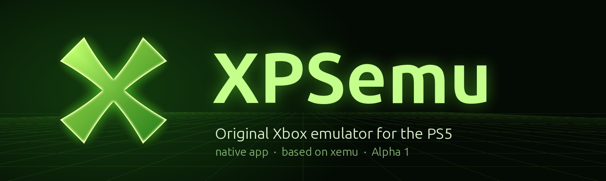

<p align="center">
  
</p>

<p align="center">
  <b>The original Xbox, running natively on a PlayStation 5.</b><br>
  A port of <a href="https://xemu.app">xemu</a> to the jailbroken PS5 as a native app, with its own Xbox-style dashboard.
</p>

<p align="center">
  
  
  
  
  
</p>

---

> **Alpha 1** is the first public build. It boots and plays real games, but expect bugs, slow scenes in
> CPU-heavy games, and missing features. Please report problems with your `xemu-game.log` attached (see [Logs](#logs-and-reporting-problems)).

## Table of contents

- [What is XPSemu?](#what-is-xpsemu)
- [Features](#features)
- [Compatibility](#compatibility)
- [Requirements](#requirements)
- [Installation](#installation)
- [Folder layout on the PS5](#folder-layout-on-the-ps5)
- [Controls](#controls)
- [Using the dashboard](#using-the-dashboard)
- [Game patches](#game-patches)
- [Settings explained](#settings-explained)
- [Performance notes](#performance-notes)
- [Logs and reporting problems](#logs-and-reporting-problems)
- [Known limitations](#known-limitations)
- [What XPSemu changes in xemu](#what-xpsemu-changes-in-xemu)
- [Building from source](#building-from-source)
- [Roadmap](#roadmap)
- [Credits](#credits)
- [License and legal](#license-and-legal)

## What is XPSemu?

XPSemu is [xemu](https://github.com/xemu-project/xemu), the open-source original Xbox emulator, ported
to the PlayStation 5 as a native application (title ID `PPSA97358`). It is not a libretro core or a
wrapper: the whole emulator (Xbox CPU through QEMU's TCG JIT, the NV2A GPU through xemu's Vulkan
renderer, the MCPX audio, the controllers) runs as a PS5 app on top of an open-source Vulkan driver
(RADV, from the PS5_Vulkan project).

On top of the port, XPSemu adds its own controller-friendly dashboard, per-game settings, cover art,
play time, game patches, a performance overlay, a per-game log and a set of CPU optimizations made for
the PS5's Zen 2 processor.

## Features

**Dashboard**
- Xbox-style dashboard made for the DualSense: animated green background, main menu, recently played shelf.
- **Games** page as a cover-flow carousel with box art, reflections and per-game info.
- Game names from the ISO file name; covers you drop in a folder (`.jpg` / `.png`).
- **Recently played** shelf and **play time** per game.
- **Xbox Dashboard** button to boot the original Microsoft dashboard from your HDD image.
- The emulated Xbox starts powered off and XPSemu always opens on its dashboard (no auto-resume of the last game).
- Menu sounds (can be turned off), title shine animation, app icon and background art.

**Per-game**
- Own settings per game: resolution, screen shape, fit, smoothing, DSP, volume, performance overlay.
- **Game patches** in Jay's Magic Patch (`.jmp`) format, applied in memory while the game loads: your ISO files are never modified.
- Automatic checksum matching: patches that are not made for your copy are blocked and labelled.
- Crash watcher: if a game crashes back to the Xbox dashboard, XPSemu tells you and notes it in the log.

**System**
- Xbox video switches (widescreen, 480p, 720p, 1080i), written to the emulated Xbox's EEPROM.
- Resolution scaling 1x (480p) to 4x, with the resolution shown next to each option.
- Performance overlay (FPS, frame time, CPU, memory).
- Per-game log (`xemu-game.log`) with FPS, frame times, thread load and a built-in CPU profiler.
- Shader, pipeline and driver caches on disk, so a second run of a game stutters much less.

## Compatibility

Tested by the developer on a PS5 with Alpha 1. "FPS" is what the game itself draws; many Xbox games are capped at 30 or 60.

| Game | Status | Notes |
|---|---|---|
| Halo 2 | ✅ Great | 30 FPS stock. With the Halo 2 60 FPS patch: 51-60 FPS in the opening, 36-50 in gameplay. Set **DSP Off**. |
| Forza Motorsport | ✅ Playable | 30 FPS (its cap) in menus and intro, 15-21 FPS while racing. Set **DSP Off**. |
| Fable: The Lost Chapters | ⚠️ Playable | 22-30 FPS in many areas (30 is its cap), 10-20 FPS in heavy areas. |
| Crash Bandicoot: The Wrath of Cortex | ✅ Great | Runs smoothly. |

Anything that runs well in xemu on PC has a good chance of running here, more slowly in CPU-heavy
scenes (see [Performance notes](#performance-notes)). xemu's own
[compatibility list](https://xemu.app/#compatibility) is a good first check. Games that fail on PC xemu
fail here too.

## Requirements

- A **jailbroken PS5** that can run homebrew apps (fake-signed titles).
- A HEN that **jailbreaks apps on request**: XPSemu asks for it the same way [PS5SX2](https://github.com/Swordpdf/PS5SX2) does (it writes its PID
  to `/download0/etahen_jailbreak`, the [etaHEN](https://github.com/LightningMods/etaHEN) protocol). Tested with the **PS5SX2 Helper** payload (with [kstuff](https://github.com/EchoStretch/kstuff)), which only
  jailbreaks title IDs listed in `/data/whitelist.txt`.
- A way to install/mount the app folder, for example **[ShadowMountPlus](https://github.com/drakmor/ShadowMountPlus)**.
- **Your own** original Xbox files, dumped from your own console (not included, never will be):
  - MCPX boot ROM: `mcpx_1.0.bin`
  - Xbox BIOS / flash ROM, for example `Complex_4627.bin`
  - An Xbox hard-disk image, for example xemu's blank `xbox_hdd.qcow2` (see [xemu's setup guide](https://xemu.app/docs/required-files/))
- **Your own games** as **XISO** images (`.iso` / `.xiso`). Full "redump" disc images must be converted to XISO first (for example with [extract-xiso](https://github.com/XboxDev/extract-xiso)).

## Installation

1. **Copy the app.** Put the `PPSA97358` folder from the release on your PS5 and install/mount it with your
   homebrew installer (for example ShadowMountPlus; one known-good place is `/data/homebrew/PPSA97358`).
2. **Allow the app jailbreak.** Add this line to `/data/whitelist.txt` (create the file if needed):
   ```
   PPSA97358
   ```
   Then load your HEN / PS5SX2 Helper payload as usual before starting XPSemu.
3. **Copy your Xbox files** to `/data/xemu/`:
   ```
   /data/xemu/mcpx_1.0.bin
   /data/xemu/Complex_4627.bin
   /data/xemu/xbox_hdd.qcow2
   ```
4. **Point XPSemu at them.** Create `/data/xemu/xemu.toml` (or edit the one XPSemu writes on first start):
   ```toml
   [sys.files]
   bootrom_path = '/data/xemu/mcpx_1.0.bin'
   flashrom_path = '/data/xemu/Complex_4627.bin'
   hdd_path = '/data/xemu/xbox_hdd.qcow2'
   eeprom_path = '/data/xemu/eeprom.bin'
   ```
   The EEPROM file is created automatically if it does not exist.
5. **Add games** to `/data/xemu/games/` (XISO `.iso` files).
6. Start **XPSemu** from the home screen. The dashboard opens; pick a game in **Games** and press ✕.

If the app closes right away or shows "jailbreak failed", check step 2 and that your HEN payload is loaded.

## Folder layout on the PS5

Everything XPSemu writes lives under `/data/xemu/` (an app's own folder is read-only on the PS5).

| Path | What it is |
|---|---|
| `/data/xemu/xemu.toml` | Main settings (xemu's format; the dashboard edits it for you). |
| `/data/xemu/games/` | Your XISO games. |
| `/data/xemu/games/covers/` or `/data/xemu/covers/` | Cover art: `<game name>.jpg` or `.png`. Matching ignores case, spaces and `(...)`/`[...]`; the title ID (e.g. `4D530064.jpg`) works too. |
| `/data/xemu/patches/` | `.jmp` game patches (subfolders are fine). |
| `/data/xemu/sounds/` | Optional: your own menu sounds (`move`, `change`, `select`, `back`, `open`, `launch`, `error` `.wav`) replace the built-in ones. |
| `/data/xemu/game-settings/` | Per-game settings and patch choices (written by the dashboard). |
| `/data/xemu/playtime.txt`, `recent.txt` | Play time and the recently played list. |
| `/data/xemu/cache/` | Shader (SPIR-V), Vulkan pipeline and driver caches. Safe to delete; they rebuild. |
| `/data/xemu/xemu.log` | The emulator's log (previous run: `xemu.log.old`). |
| `/data/xemu/xemu-game.log` | Per-game log of the last game you played (previous: `.old`). |

## Controls

**In games** (DualSense → Xbox controller)

| DualSense | Xbox |
|---|---|
| ✕ / ○ / □ / △ | A / B / X / Y |
| L1 / R1 | White / Black |
| L2 / R2 | Left / Right trigger (analog) |
| Left / right stick, L3 / R3 | Left / right stick, stick clicks |
| D-pad | D-pad |
| OPTIONS | Start |
| Create | Back |
| **Touchpad click** | Open the XPSemu dashboard (the PS button belongs to the system) |

**In the dashboard**

| Button | Action |
|---|---|
| D-pad / left stick | Move |
| ✕ | Select / launch / change a value |
| ○ | Back |
| △ (on a game) | That game's settings and patches |
| L1 / R1 (Games page) | Jump 5 games |
| Touchpad | Return to the running game |

## Using the dashboard

- **Games**: browse the carousel, ✕ to play. The info panel shows play time and any per-game overrides.
- **Recently played**: the shelf under the main menu; move down from the last menu item to reach it.
- **Settings**: resolution, screen shape, fit, smoothing, volume, menu sounds, and **Advanced**.
- **System**: emulator info, restart, eject.
- **Xbox Dashboard**: boots the original Microsoft dashboard from your HDD image (useful for Xbox system settings and saves).

The resolution can't be changed while a game is running (changing it under a running game could crash the
GPU). Change it in the dashboard before launching; per-game resolutions apply when the game starts.

## Game patches

XPSemu reads patches in **Jay's Magic Patch** format (`.jmp`, as published on [JayXbox PatchHub](https://www.jayxbox.com/Retail-Game-Modification/PatchHub.php)) from
`/data/xemu/patches/`. Open a game's settings (△) → **Game patches** to turn groups on or off.

- Patches are applied **in memory while the game reads its executable**. Your ISO is never changed.
- XPSemu computes your copy's checksum and compares it with the patch:
  - **Works**: made for your copy, or made for another release but every searched code pattern was found exactly once in yours.
  - **Other version** / **Not in this game** / **Not supported**: blocked, with the reason shown.
- Patches that **append** new code to the executable (`APPEND` records, such as Halo 2 HD) are not supported yet.
- A notification confirms when a patch was really applied while the game loaded.

## Settings explained

| Setting | What it does |
|---|---|
| Resolution (1x-4x) | Internal rendering scale: 1x is the Xbox's own 480p. The PS5 GPU has plenty of headroom, so higher values look sharper at almost no cost. |
| Screen shape | 4:3, 16:9 stretch or Auto. Games only render true widescreen if they support it (turn on the Xbox widescreen switch in Advanced). |
| DSP | Emulates the Xbox audio DSP. **Keep it Off**: without a JIT on the PS5 it is very slow (Halo 2 freezes, Forza crawls). |
| Xbox widescreen / 480p / 720p / 1080i | The Xbox's video settings in its EEPROM. Only games that support them use them. Applied at the next game start. |
| Xbox memory | Locked to 64 MB in Alpha 1 (128 MB needs more PS5 memory than is available to apps). |
| CPU pinning | Gives the Xbox CPU and GPU threads their own PS5 cores (recommended, default on). |
| Profiler | Samples where the emulator spends time and writes it to the game log (very low cost; default on). |
| Performance overlay | Off / FPS / full statistics on screen. |

## Performance notes

On the PS5 the **emulated Xbox CPU is the bottleneck**: the Xbox CPU thread is busy 85-97% of the
time while the PS5 GPU is mostly idle. That is why raising the resolution does not lower FPS (use 3x/4x
freely) and why upscalers like FSR do not add FPS here.

xemu translates Xbox CPU code with QEMU's general-purpose TCG translator. The PS5's Zen 2 cores (3.5 GHz)
are slower per core than a fast PC, so CPU-heavy games (Fable's busy areas, Forza races) drop below their
cap. XPSemu already removes the biggest costs it found with its built-in profiler (see the
[CPU optimizations](#cpu-and-performance)): Fable's opening went from ~7 FPS in the first PS5 builds to 23-30 FPS.

Tips:
- **DSP Off**, always.
- Leave **CPU pinning** on.
- The first time you play a game it compiles shaders; the second run is much smoother (caches in `/data/xemu/cache`).

## Logs and reporting problems

After playing, copy `/data/xemu/xemu-game.log` (and `xemu.log`) from the PS5. The game log has:
- a header with the game, title ID, file, settings, caches and patches,
- every 5 s: FPS, slowest frame, CPU load per emulator thread, GPU work, and time spent per step,
- profiler reports (where the Xbox CPU thread spends its time) at 30 s, every 2 minutes and at the end.

When reporting a problem, include the game name, what happened, and both logs.

## Known limitations

- **Alpha**: expect bugs.
- **CPU-bound**: heavy scenes in some games run below their cap (see above).
- **64 MB Xbox memory only** (no 128 MB debug-kit mode).
- **XISO only**: full redump images must be converted.
- **DSP must stay Off** for most games.
- **Resolution** changes only between games.
- **Patches with APPEND records** are not supported.
- No save states or save manager yet (games save to the HDD image as on a real Xbox).
- File dialogs from xemu's original UI don't exist on the PS5; use the dashboard and the folders above.

## What XPSemu changes in xemu

XPSemu is based on xemu `0.8.136` (upstream commit `478b4f4961`). Everything below is in this repository.
PS5-only code is guarded with `#ifdef __PROSPERO__`, so the desktop build of xemu is unchanged by most of it.
A full diff of the modified upstream files is in [`ps5/XPSEMU-CHANGES.diff`](ps5/XPSEMU-CHANGES.diff).

### Making xemu run on the PS5

- **Cross-build for the PS5**: meson cross file (`ps5/ps5-cross.ini`), `ps5/configure-ps5.sh`, and
  `ps5/deps/build-deps.sh`, which cross-compiles xemu's libraries (zlib, libiconv, GLib, pixman,
  libsamplerate, SDL3, libpcap, curl, libslirp) as static libraries with the PS5 toolchain.
- **Vulkan-only build**: OpenGL/epoxy made optional (`meson.build`, pgraph GL renderer and gloffscreen
  guarded), Vulkan enabled on the PS5's FreeBSD-based OS, the DSP56300 Rust JIT made optional with the
  interpreter as fallback.
- **New Vulkan presentation for the UI** (`ui/xui/vk-present.cc`, `ui/xemu-texture.h`,
  `hw/xbox/nv2a/pgraph/vk/vk-ui.h`): xemu's UI normally needs an OpenGL window; on the PS5 it draws with
  Dear ImGui's Vulkan backend onto a 4K `VK_KHR_display` swapchain, sharing the device and queue with
  the NV2A renderer. Screenshots and thumbnails read back through Vulkan.
- **Linking as a PS5 title** (`ps5/build-title.sh`): relinks xemu's objects with RADV, the payload SDK's
  libc++ and platform layer, the CRT and AGC stubs from PS5_Vulkan, then makes the signed `eboot.bin`,
  `param.json` and art for `PPSA97358`.
- **Missing C library pieces** (`ps5/compat/`): user-space `getcontext`/`makecontext`/`swapcontext` for
  QEMU's coroutines, `ppoll`, `pipe2`, `closefrom`, `timegm`, `mkstemp`, `fnmatch` and other gaps,
  and a startup scan that reports any unresolved system import.
- **Memory** (`ps5/compat/mmap.c`, `tcg/region.c`, `util/oslib-posix.c`): `mmap` mapped onto the PS5's
  flexible/direct memory, allocations kept out of the GPU's address window, the TCG JIT buffer in
  executable shared memory (as PS5SX2 does), coroutine stacks from the heap, file-mapping fallback to
  read-into-memory.
- **Sandbox**: requests the app jailbreak from the HEN at startup; all data under `/data/xemu`.
- **DualSense input** (`ui/xemu-input-ps5.c`) through libScePad, mapped to an Xbox controller.
- **Audio** through SceAudioOut (`hw/xbox/mcpx/apu/monitor.c`).
- **Crash handler and logging**: crash address, backtrace and load address in `xemu.log`, kernel
  notifications on fatal errors, hide the PS5 splash screen after the first frame.
- **Startup behaviour**: Xbox starts powered off (`-S`), no auto-resume of the last game, 64 MB forced,
  `geteuid`/`getegid` wrapped so Mesa's shader cache works after the jailbreak.

### Fixes

- **Halo 2 black screen**: the Vulkan display shader passed the game's alpha through, so X8R8G8B8
  framebuffers were invisible once drawn with blending. Output alpha is now forced to 1.
- **Upside-down picture** with the Vulkan display image in the Vulkan UI.
- **GPU page fault when raising the resolution** under a running game: resolution changes are now applied
  only when a game starts or stops.
- **`vga.vram` out of memory**: the VGA device no longer allocates a throwaway RAM-sized buffer.
- QEMU's `pthread_once`-based init and signal masks behave differently on the PS5; XPSemu's own code
  works around both.

### CPU and performance

All found and measured with the built-in profiler and stopwatches in the game log.

| Change | Where | Effect |
|---|---|---|
| ThinLTO + `-march=znver2` (x86-64-v3) build | `ps5/configure-ps5.sh` | Whole emulator optimized for the PS5's Zen 2. |
| CPU pinning: Xbox CPU and GPU threads on their own cores | `ui/xemu-os-utils-ps5.c` | Less interference from other threads. |
| UI frame skip: only fetch the game's frame when it changed | `ui/xemu.c` | The UI no longer stalls the GPU thread 60 times a second. Fable 7-10 → 12-22 FPS. |
| Bigger TB jump cache (4096 → 16384 entries) | `accel/tcg/tb-jmp-cache.h` | Fewer slow hash-table lookups of translated code. |
| MMX unpack/pack with the host's SSE instructions | `target/i386/ops_sse.h` | One host instruction instead of a loop per Xbox instruction. |
| SSE add/sub/mul/div on the host's SSE when the result is guaranteed bit-exact | `target/i386/ops_sse.h` | Skips software float emulation in the common case; NaN/inf/denormal/underflow cases still take the exact path. |
| Float ↔ int conversions on the host | `fpu/softfloat.c` | `cvtps2pi`, `cvtps2dq`, `cvtpi2ps`… in one instruction, flags kept exact. |
| MMX `punpck*` generated inline in the translated code | `target/i386/tcg/emit.c.inc` | No helper call at all for the most frequent MMX instructions. |
| 49 pure MMX/SSE helpers marked `TCG_CALL_NO_RWG` | `target/i386/tcg/ops_sse_header.h.inc` | The translated code no longer saves and reloads every Xbox register around each call. |
| SPIR-V shader disk cache, Vulkan pipeline cache, Mesa/RADV cache | `hw/xbox/nv2a/pgraph/vk/glsl.c`, `draw.c` | Far fewer shader-compile stutters after the first run. |
| GLSL validation off in release | `glsl.c` | Faster shader compiles. |

Combined, Fable: The Lost Chapters' opening went from ~7 FPS to 23-30 FPS, and Halo 2 runs at 36-60 FPS with its 60 FPS patch.
The MMX and conversion fast paths were checked against the original emulated code on hundreds of thousands of random inputs;
the SSE math fast path only runs where the host's result is bit-identical by construction (normal inputs and results, round-to-nearest, inexact flag already set).

### New features (XPSemu's own code)

| File | What |
|---|---|
| `ui/xui/dashboard.cc/.hh` | The dashboard: pages, carousel, shelf, settings, patches UI, crash watcher. |
| `ui/xui/xiso.cc/.hh` | Reads `default.xbe` from XISO/redump images: title, title ID, checksum. |
| `ui/xui/game-profile.cc/.hh` | Per-game settings and play time. |
| `ui/xui/game-patches.cc/.hh` | `.jmp` parser, checksum matching, in-memory patching (hook in `block/raw-format.c`). |
| `ui/xui/game-log.cc/.hh` | The per-game log, profiler reports and cache saves. |
| `ui/xui/ui-sounds.cc/.hh` | Menu sounds (built-in, embedded, or your own `.wav`). |
| `hw/xbox/xemu-eeprom.h`, `hw/xbox/smbus_storage.c` | Xbox video switches in the EEPROM (with checksum). |
| `hw/xbox/xemu-timing.h` | Stopwatches used by the game log. |
| `ui/xemu-os-utils-ps5.c` | PS5 startup, jailbreak request, crash handler, pinning, profiler. |
| `config_spec.yml` | New settings: performance overlay, menu sounds, CPU pinning, profiler, shader cache. |

## Building from source

The build runs on Linux (tested on WSL2 Ubuntu). You need the PS5 toolchain and RADV from
**PS5_Vulkan** (by [Mihawk-99](https://github.com/mihawk-99)) first.

1. **PS5_Vulkan**: clone it to `~/ps5/PS5_Vulkan` and build its toolchain, RADV release archive and host
   tools following its documentation. XPSemu uses:
   - the payload SDK: `~/ps5/PS5_Vulkan/.deps/native/ps5-payload-sdk`
   - RADV: `~/ps5/PS5_Vulkan/.deps/native/radv-release/lib/libvulkan_radeon.ps5.a`
   - the title packager: `~/ps5/PS5_Vulkan/build/host/ps5-native-tool`

   Other locations can be passed with `PS5_VULKAN`, `PS5_PAYLOAD_SDK` and `RADV_ARCHIVE`.
2. **Build tools**: `meson`, `ninja`, `python3` (with `pyyaml`), `curl`, `git`; Python `Pillow` and `numpy` only to redraw the art.
3. **Dependencies** (downloads and cross-compiles into `ps5/deps/prefix`):
   ```sh
   ps5/deps/build-deps.sh compat zlib libiconv glib pixman libsamplerate sdl3 vulkan libpcap curl libslirp
   ```
4. **Configure** (into `build-ps5/`):
   ```sh
   ps5/configure-ps5.sh
   ```
5. **Compile**:
   ```sh
   ninja -C build-ps5 qemu-system-i386
   ```
   The very last step, xemu's desktop link, **fails on purpose** (duplicate `ppoll` and similar symbols):
   the PS5 title is linked by the next step instead.
6. **Make the PS5 title**:
   ```sh
   bash ps5/build-title.sh
   ```
   The result is `dist/PPSA97358/` (`eboot.bin`, `sce_sys/`, ...). `build-ps5/title/llvm-pie.elf` keeps
   the symbols for reading crash addresses:
   ```sh
   llvm-addr2line -f -C -e build-ps5/title/llvm-pie.elf 0x<eboot offset>
   ```

Art: `ps5/art/make-art.py` draws the icon and background sources (converted with PS5_Vulkan's
`tools/prepare-assets.sh`); `ps5/art/make-banner.py` draws this README's banner.
Menu sounds: `ps5/sounds/embed-sounds.py` turns `ps5/sounds/*.wav` into `ui/xui/ui-sounds-data.h`.

## Roadmap

- **Smooth mode**: optional frame generation (FSR 3 frame interpolation through an open-source Vulkan port) to show 30 FPS games at 60.
- More CPU fast paths guided by the profiler.
- Save manager and save states.
- `APPEND` patches (code caves) for patches like Halo 2 HD.
- More of the PS5 polish: favourites, sorting.

## Credits

- **[xemu](https://github.com/xemu-project/xemu)** ([xemu.app](https://xemu.app)) and its contributors: the emulator this is built on.
- **[QEMU](https://www.qemu.org/)** ([source](https://gitlab.com/qemu-project/qemu)): the machine emulation and the TCG JIT under xemu.
- **[Mihawk-99](https://github.com/mihawk-99)'s PS5_Vulkan / PS5_Mesa**: RADV ([Mesa](https://gitlab.freedesktop.org/mesa/mesa)'s open-source AMD Vulkan driver) running on the PS5, the toolchain integration and title packaging XPSemu links against. (The repositories are not public at the time of writing.)
- **[ps5-payload-dev SDK](https://github.com/ps5-payload-dev/sdk)** (as pinned by Mihawk-99's PS5_PayloadSDK): the open PS5 payload SDK.
- **[PS5SX2](https://github.com/Swordpdf/PS5SX2)** by Swordpdf: reference for the app jailbreak request, CPU core layout, JIT memory and DualSense reading on the PS5.
- **[etaHEN](https://github.com/LightningMods/etaHEN)** (LightningMods), **[kstuff](https://github.com/EchoStretch/kstuff)** (EchoStretch, from [ps5-payload-dev/kstuff](https://github.com/ps5-payload-dev/kstuff)), **[ShadowMountPlus](https://github.com/drakmor/ShadowMountPlus)** (drakmor) and the PS5 scene for making homebrew apps possible.
- **Jay's Magic Patch / [JayXbox PatchHub](https://www.jayxbox.com/Retail-Game-Modification/PatchHub.php)**: the patch format and the community's patches.
- **[Dear ImGui](https://github.com/ocornut/imgui)**, **[SDL3](https://github.com/libsdl-org/SDL)**, **[GLib](https://gitlab.gnome.org/GNOME/glib)**, **[glslang](https://github.com/KhronosGroup/glslang)**, **[Vulkan Memory Allocator](https://github.com/GPUOpen-LibrariesAndSDKs/VulkanMemoryAllocator)** and the other libraries xemu uses.

XPSemu's icon, background and banner are original artwork (a green "X" emblem); they are not the Xbox logo.

## License and legal

XPSemu is licensed under the **GNU General Public License v2**, like xemu and QEMU (see [`LICENSE`](LICENSE) and [`COPYING`](COPYING)).
Third-party components keep their own licenses.

XPSemu **does not include** any Microsoft BIOS, MCPX ROM, dashboard, game or other copyrighted Xbox
content, and never will. Use your own legally dumped files and games.

XPSemu is an independent fan project. It is **not affiliated with, endorsed by or sponsored by Microsoft,
Sony Interactive Entertainment or the xemu project**. "Xbox" is a trademark of Microsoft; "PlayStation"
and "PS5" are trademarks of Sony Interactive Entertainment.
